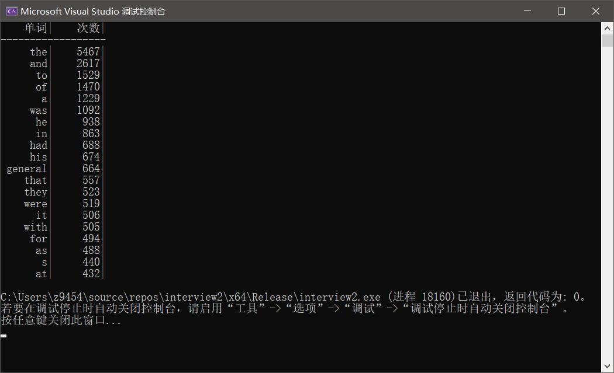

# Documentation For Interview Question 2
>This document is written by @weiweiever, just for a test and  the interview of Shenzhen SinoSmart Digital Tech. Co. LTD.
## The original question
Write a program for displaying the ten most frequent words in a file such that your program should be efficient in all complexity measures. Require C/C++.

## My development environment

1. windows10 
2. Visual Studio Community 2019 
3.  C++

## File structure
1. aWord.cpp/.h	——custom data type for single word
2. readWordFromFile.cpp/.h 	——custom class for reading words
3. wordListClass.cpp/.h	——custom class for storing and analysing words
4. interview2.cpp     ——for main function

### aWord class
This class defined a custom datatype for single word, each subject have two data: `word`for the word itself and `count` for times it has appeared.

### readWordFromFile class
This class defined a class for reading words from a txt file. 

The most important function is `readAWord()` , and I believe you can understand my code by reading the notation.

### wordListClass class
This class achieved a class for words storing and analysing. including adding a word, finding a word, finding most used words and sorting them.

At first is `addAWord()` , this function will add a new word to our list or let the counter of existing word increased.

The most important function  is `findMostWords()`, this function will find the given number of most appeared words. It will travel every element in word list and compare its counter with the variable minimum,which recorded the least counter in our ranking list such that we have found the most appeared words. at last we sort them and return.

### interview.cpp

This file has the main function. It does the initialization and read words and find the most words and eventually print them out in certain form.

## Tests
For convenience, I have downloaded a English novel from http://novel.tingroom.com/ and renamed it as novel.txt. then I ran the program, and the result is following:

I believe that's right.
